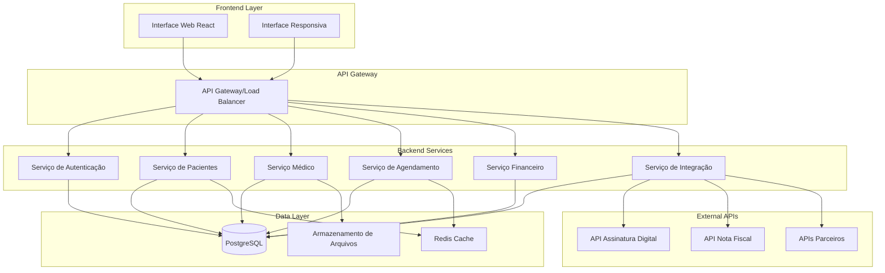
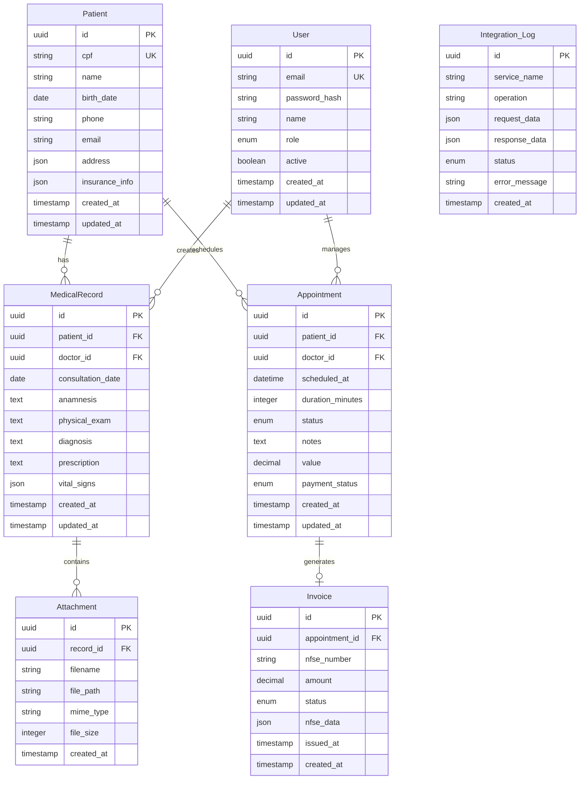

# Documento de Design - VisionCare

## Visão Geral

O VisionCare será desenvolvido como uma aplicação web moderna com arquitetura de três camadas, utilizando tecnologias web atuais para garantir performance, segurança e escalabilidade. O sistema prioriza a experiência do usuário com interface clean e profissional, seguindo padrões de design médico e compliance com regulamentações de dados de saúde.

### Tecnologias Principais
- **Frontend**: React.js com TypeScript para interface responsiva
- **Backend**: Node.js com Express.js para APIs RESTful
- **Banco de Dados**: PostgreSQL para dados estruturados
- **Autenticação**: JWT com refresh tokens
- **Hospedagem**: Cloud com certificação SSL/TLS

## Arquitetura

### Arquitetura Geral do Sistema



### Padrões Arquiteturais
- **Microserviços**: Separação de responsabilidades em serviços independentes
- **Repository Pattern**: Abstração da camada de dados
- **Service Layer**: Lógica de negócio centralizada
- **API First**: Design orientado por APIs RESTful
- **Event-Driven**: Comunicação assíncrona entre serviços

## Componentes e Interfaces

### Frontend - Interface do Usuário

#### Design System
- **Paleta de Cores**:
  - Azul Primário: #2563EB (botões principais, headers)
  - Azul Secundário: #3B82F6 (links, elementos interativos)
  - Azul Claro: #EFF6FF (backgrounds, cards)
  - Branco: #FFFFFF (backgrounds principais)
  - Cinza: #6B7280 (textos secundários)
  - Verde: #10B981 (sucesso, confirmações)
  - Vermelho: #EF4444 (erros, alertas)

#### Componentes Principais
1. **Dashboard**: Visão geral com métricas e ações rápidas
2. **Gestão de Pacientes**: CRUD completo com busca avançada
3. **Prontuário Eletrônico**: Interface rica para entrada de dados médicos
4. **Agenda**: Calendário interativo com drag-and-drop
5. **Relatórios**: Dashboards com gráficos e exportação
6. **Configurações**: Gerenciamento de usuários e integrações

#### Responsividade
- **Desktop**: Layout completo com sidebar e múltiplas colunas
- **Tablet**: Layout adaptado com navegação por tabs
- **Mobile**: Interface simplificada com navegação bottom-up

### Backend - APIs e Serviços

#### API de Autenticação
```typescript
interface AuthAPI {
  POST /auth/login: { email, password } → { token, refreshToken, user }
  POST /auth/refresh: { refreshToken } → { token }
  POST /auth/logout: { refreshToken } → { success }
  GET /auth/profile: → { user }
}
```

#### API de Pacientes
```typescript
interface PatientAPI {
  GET /patients: → { patients[], pagination }
  GET /patients/:id: → { patient }
  POST /patients: { patientData } → { patient }
  PUT /patients/:id: { patientData } → { patient }
  DELETE /patients/:id: → { success }
  GET /patients/search: { query } → { patients[] }
}
```

#### API de Prontuários
```typescript
interface MedicalRecordAPI {
  GET /patients/:id/records: → { records[] }
  GET /records/:id: → { record }
  POST /records: { recordData } → { record }
  PUT /records/:id: { recordData } → { record }
  POST /records/:id/attachments: { file } → { attachment }
}
```

#### API de Agendamentos
```typescript
interface ScheduleAPI {
  GET /schedule: { date?, doctor? } → { appointments[] }
  POST /appointments: { appointmentData } → { appointment }
  PUT /appointments/:id: { appointmentData } → { appointment }
  DELETE /appointments/:id: → { success }
  GET /availability: { date, doctor } → { availableSlots[] }
}
```

#### API de Integrações
```typescript
interface IntegrationAPI {
  POST /integrations/digital-signature: { documentId } → { signatureUrl }
  POST /integrations/nfse: { appointmentId } → { invoice }
  GET /integrations/partners/:partnerId/patient/:patientId: → { patientData }
  POST /integrations/partners/prescription: { prescriptionData } → { success }
}
```

## Modelos de Dados

### Modelo de Dados Principal



### Estruturas de Dados Específicas

#### Dados do Paciente
```typescript
interface Patient {
  id: string;
  cpf: string;
  name: string;
  birthDate: Date;
  phone: string;
  email?: string;
  address: {
    street: string;
    number: string;
    complement?: string;
    neighborhood: string;
    city: string;
    state: string;
    zipCode: string;
  };
  insuranceInfo?: {
    provider: string;
    planNumber: string;
    validUntil: Date;
  };
  emergencyContact: {
    name: string;
    phone: string;
    relationship: string;
  };
}
```

#### Prontuário Médico
```typescript
interface MedicalRecord {
  id: string;
  patientId: string;
  doctorId: string;
  consultationDate: Date;
  chiefComplaint: string;
  anamnesis: string;
  physicalExam: {
    visualAcuity: {
      rightEye: string;
      leftEye: string;
    };
    intraocularPressure: {
      rightEye: number;
      leftEye: number;
    };
    fundoscopy: string;
    biomicroscopy: string;
  };
  diagnosis: string;
  prescription: string;
  followUpDate?: Date;
  attachments: Attachment[];
}
```

## Tratamento de Erros

### Estratégia de Tratamento de Erros

#### Frontend
- **Boundary Components**: Captura de erros React com fallback UI
- **Toast Notifications**: Feedback visual para erros e sucessos
- **Form Validation**: Validação em tempo real com mensagens claras
- **Network Error Handling**: Retry automático e fallback offline

#### Backend
- **Global Error Handler**: Middleware centralizado para tratamento de erros
- **Structured Logging**: Logs estruturados com níveis de severidade
- **Error Codes**: Códigos padronizados para diferentes tipos de erro
- **Graceful Degradation**: Funcionalidade reduzida em caso de falhas

#### Códigos de Erro Padronizados
```typescript
enum ErrorCodes {
  // Autenticação
  INVALID_CREDENTIALS = 'AUTH_001',
  TOKEN_EXPIRED = 'AUTH_002',
  INSUFFICIENT_PERMISSIONS = 'AUTH_003',
  
  // Validação
  INVALID_CPF = 'VAL_001',
  REQUIRED_FIELD = 'VAL_002',
  INVALID_DATE = 'VAL_003',
  
  // Negócio
  PATIENT_NOT_FOUND = 'BUS_001',
  APPOINTMENT_CONFLICT = 'BUS_002',
  RECORD_LOCKED = 'BUS_003',
  
  // Integração
  EXTERNAL_API_ERROR = 'INT_001',
  SIGNATURE_FAILED = 'INT_002',
  INVOICE_ERROR = 'INT_003'
}
```

## Estratégia de Testes

### Pirâmide de Testes

#### Testes Unitários (70%)
- **Frontend**: Jest + React Testing Library
- **Backend**: Jest + Supertest
- **Cobertura**: Mínimo 80% para lógica de negócio

#### Testes de Integração (20%)
- **API Testing**: Testes end-to-end das APIs
- **Database Testing**: Testes com banco de dados real
- **External API Mocking**: Mock das integrações externas

#### Testes E2E (10%)
- **Cypress**: Testes de fluxos críticos
- **User Journeys**: Cenários completos de uso
- **Cross-browser**: Testes em diferentes navegadores

### Cenários de Teste Críticos
1. **Fluxo de Cadastro de Paciente**: Do cadastro ao primeiro agendamento
2. **Fluxo de Consulta**: Agendamento → Atendimento → Prontuário → Pagamento
3. **Integração com Assinatura Digital**: Assinatura de receitas e laudos
4. **Emissão de Nota Fiscal**: Processo completo de faturamento
5. **Segurança**: Testes de autenticação e autorização

### Ambiente de Testes
- **CI/CD Pipeline**: Testes automatizados em cada commit
- **Staging Environment**: Ambiente de homologação com dados sintéticos
- **Performance Testing**: Testes de carga e stress
- **Security Testing**: Testes de vulnerabilidades e penetração

## Considerações de Segurança

### Proteção de Dados Médicos
- **Criptografia**: Dados sensíveis criptografados em repouso e trânsito
- **LGPD Compliance**: Implementação de direitos dos titulares
- **Audit Trail**: Log completo de acessos e modificações
- **Data Retention**: Políticas de retenção e exclusão de dados

### Autenticação e Autorização
- **Multi-factor Authentication**: 2FA opcional para usuários
- **Role-based Access Control**: Permissões granulares por função
- **Session Management**: Controle rigoroso de sessões
- **Password Policies**: Políticas de senha robustas

### Segurança da Aplicação
- **Input Validation**: Sanitização de todas as entradas
- **SQL Injection Prevention**: Uso de prepared statements
- **XSS Protection**: Content Security Policy e sanitização
- **CSRF Protection**: Tokens CSRF em formulários

### Monitoramento e Alertas
- **Security Monitoring**: Detecção de atividades suspeitas
- **Failed Login Alerts**: Alertas para tentativas de acesso
- **Data Access Monitoring**: Monitoramento de acessos a dados sensíveis
- **Backup Security**: Backups criptografados e testados regularmente