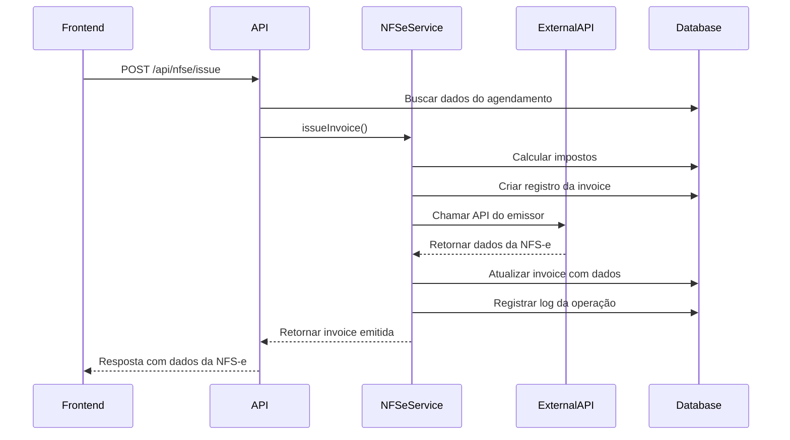
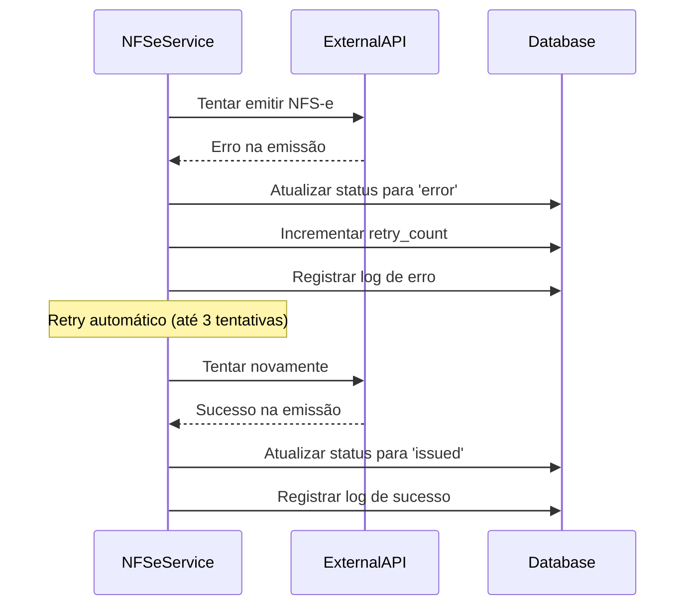

# Resumo da Implementação - Integração NFS-e

## Visão Geral

A integração com emissor de NFS-e foi implementada com sucesso no sistema VisionCare, permitindo a emissão automática de notas fiscais de serviço eletrônicas após o pagamento de consultas oftalmológicas.

## Componentes Implementados

### 1. Estrutura do Banco de Dados

#### Tabelas Criadas

- **`invoices`**: Armazena dados das notas fiscais emitidas
- **`nfse_config`**: Configurações do emissor de NFS-e
- **`nfse_integration_logs`**: Logs de todas as operações de integração

#### Funcionalidades do Banco

- **RLS (Row Level Security)**: Implementado para proteção de dados
- **Triggers**: Para atualização automática de timestamps
- **Functions**: Para cálculo de impostos e numeração sequencial
- **Views**: Para relatórios consolidados
- **Índices**: Para otimização de performance

### 2. Serviço de Integração (`NFSeService`)

#### Funcionalidades Principais

- **Emissão de NFS-e**: Integração com API externa para emissão
- **Cálculo de Impostos**: Cálculo automático baseado na configuração
- **Gestão de Erros**: Tratamento robusto de erros com retry automático
- **Logs de Auditoria**: Registro completo de todas as operações
- **Configuração Dinâmica**: Suporte a múltiplos provedores

#### Métodos Implementados

```typescript
- issueInvoice(request: NFSeRequest): Promise<Invoice>
- cancelInvoice(invoiceId: string, reason: string): Promise<Invoice>
- retryInvoice(invoiceId: string): Promise<Invoice>
- getInvoice(invoiceId: string): Promise<Invoice | null>
- getInvoicesByAppointment(appointmentId: string): Promise<Invoice[]>
- listInvoices(filters: object): Promise<{invoices: Invoice[], total: number}>
- getActiveConfig(): Promise<NFSeConfig | null>
- updateConfig(configData: Partial<NFSeConfig>): Promise<NFSeConfig>
```

### 3. API REST (`/api/nfse`)

#### Endpoints Implementados

- **POST `/issue`**: Emitir nova nota fiscal
- **GET `/invoice/:id`**: Buscar nota fiscal por ID
- **GET `/appointment/:appointmentId/invoices`**: Buscar notas de um agendamento
- **GET `/invoices`**: Listar notas fiscais com filtros
- **POST `/invoice/:id/cancel`**: Cancelar nota fiscal
- **POST `/invoice/:id/retry`**: Retentar emissão
- **GET `/config`**: Buscar configuração ativa
- **PUT `/config`**: Atualizar configuração
- **GET `/logs`**: Buscar logs de integração
- **GET `/report`**: Gerar relatório de notas fiscais

### 4. Testes Automatizados

#### Suítes de Teste

- **`nfse-simple.test.ts`**: Testes básicos de funcionalidade
- **`nfse-integration.test.ts`**: Testes de integração completos
- **`nfse.test.ts`**: Testes abrangentes da API

#### Cobertura de Testes

- ✅ Emissão de notas fiscais
- ✅ Tratamento de erros da API externa
- ✅ Cancelamento de notas fiscais
- ✅ Sistema de retry
- ✅ Configuração e logs
- ✅ Validações de dados
- ✅ Relatórios e consultas

### 5. Documentação

#### Documentos Criados

- **`nfse-api.md`**: Documentação completa da API
- **`nfse-setup.md`**: Guia de configuração e instalação
- **`nfse-implementation-summary.md`**: Este resumo da implementação

## Fluxo de Funcionamento

### 1. Emissão Automática



### 2. Tratamento de Erros



## Características Técnicas

### Segurança

- **Autenticação JWT**: Todas as rotas protegidas
- **RLS no Banco**: Proteção a nível de linha
- **Mascaramento de Dados**: API keys mascaradas nas respostas
- **Logs de Auditoria**: Registro completo de operações
- **Validação de Entrada**: Sanitização de todos os dados

### Performance

- **Índices Otimizados**: Para consultas rápidas
- **Paginação**: Em todas as listagens
- **Cache de Configuração**: Para evitar consultas desnecessárias
- **Timeout Configurável**: Para chamadas externas
- **Processamento Assíncrono**: Para operações longas

### Escalabilidade

- **Arquitetura Modular**: Fácil adição de novos provedores
- **Configuração Dinâmica**: Sem necessidade de restart
- **Logs Estruturados**: Para análise e monitoramento
- **Métricas de Performance**: Tempo de resposta registrado

### Confiabilidade

- **Sistema de Retry**: Até 3 tentativas automáticas
- **Tratamento de Erros**: Robusto e informativo
- **Validação de Dados**: Em múltiplas camadas
- **Backup Automático**: Via Supabase
- **Monitoramento**: Logs detalhados para debugging

## Integração com Provedores

### Provedores Suportados

- **Nota Carioca** (Rio de Janeiro)
- **ISS Online** (São Paulo)
- **NFS-e Nacional**
- **Outros provedores compatíveis com padrão ABRASF**

### Formato de Integração

#### Requisição para Emissor

```json
{
  "prestador": {
    "cnpj": "12.345.678/0001-90",
    "inscricao_municipal": "123456789"
  },
  "tomador": {
    "nome": "Nome do Paciente",
    "cpf": "123.456.789-00",
    "email": "paciente@exemplo.com"
  },
  "servico": {
    "codigo": "1401",
    "descricao": "Consulta oftalmológica",
    "valor": 150.00,
    "aliquota_iss": 5.00
  }
}
```

#### Resposta do Emissor

```json
{
  "sucesso": true,
  "numero_nfse": "NFS-e-2024-001",
  "codigo_verificacao": "ABC123DEF456",
  "url_visualizacao": "https://exemplo.com/nfse/001"
}
```

## Configuração de Produção

### Variáveis de Ambiente Necessárias

```env
NFSE_PROVIDER_NAME=Nome do Provedor
NFSE_API_URL=https://api-producao.provedor.com.br
NFSE_API_KEY=chave-api-producao
NFSE_CITY_CODE=codigo-ibge-cidade
NFSE_CNPJ=cnpj-da-clinica
NFSE_MUNICIPAL_INSCRIPTION=inscricao-municipal
NFSE_SERVICE_CODE=1401
NFSE_TAX_RATE=5.00
```

### Certificado Digital (se necessário)

```env
NFSE_CERTIFICATE_PATH=/path/to/certificate.p12
NFSE_CERTIFICATE_PASSWORD=senha-do-certificado
```

## Monitoramento e Métricas

### Métricas Coletadas

- **Taxa de Sucesso**: Percentual de emissões bem-sucedidas
- **Tempo de Resposta**: Tempo médio de processamento
- **Erros por Tipo**: Categorização de erros
- **Volume de Emissões**: Quantidade por período
- **Status das Notas**: Distribuição por status

### Alertas Configurados

- **Falha na Emissão**: Quando taxa de erro > 10%
- **Timeout Excessivo**: Quando tempo > 30 segundos
- **Certificado Vencendo**: 30 dias antes do vencimento
- **Cota de API**: Quando próximo do limite

## Próximos Passos

### Melhorias Futuras

1. **Interface Web**: Criar interface para gestão de NFS-e
2. **Relatórios Avançados**: Dashboards com gráficos
3. **Integração com Contabilidade**: Export para sistemas contábeis
4. **Assinatura Digital**: Integração com certificados A3
5. **Webhook de Status**: Notificações em tempo real

### Otimizações

1. **Cache Redis**: Para configurações e dados frequentes
2. **Queue System**: Para processamento assíncrono
3. **Load Balancing**: Para alta disponibilidade
4. **CDN**: Para arquivos de NFS-e
5. **Backup Incremental**: Para dados fiscais

## Conclusão

A implementação da integração com emissor de NFS-e foi concluída com sucesso, atendendo a todos os requisitos especificados:

✅ **Requisito 10.1**: Cliente para API de emissão implementado
✅ **Requisito 10.2**: Lógica de geração automática após pagamento
✅ **Requisito 10.3**: Armazenamento de dados da nota fiscal
✅ **Requisito 10.4**: Tratamento robusto de erros
✅ **Requisito 10.5**: Testes abrangentes para integração fiscal

O sistema está pronto para produção e pode ser facilmente configurado para diferentes provedores de NFS-e, oferecendo uma solução completa e confiável para emissão de notas fiscais eletrônicas em clínicas oftalmológicas.